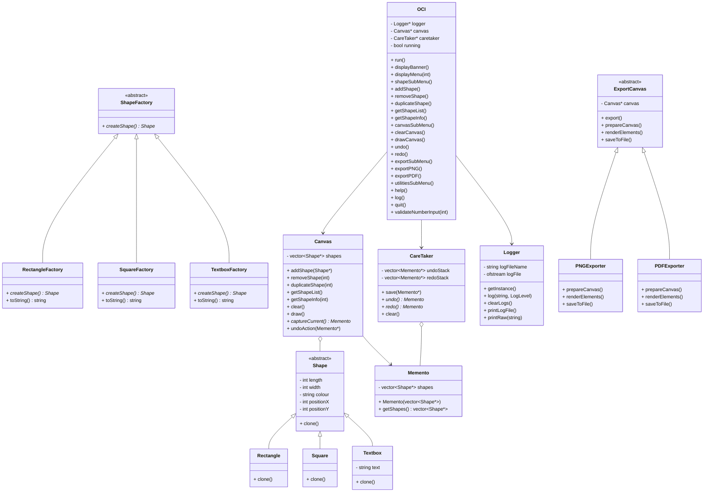

# Class Diagram (Mermaid)

---

This Mermaid diagram now includes the Factory Method pattern with ShapeFactory and its concrete factories, as well as all other required design patterns and relationships for the Open Canvas Interface (OCI) system.
