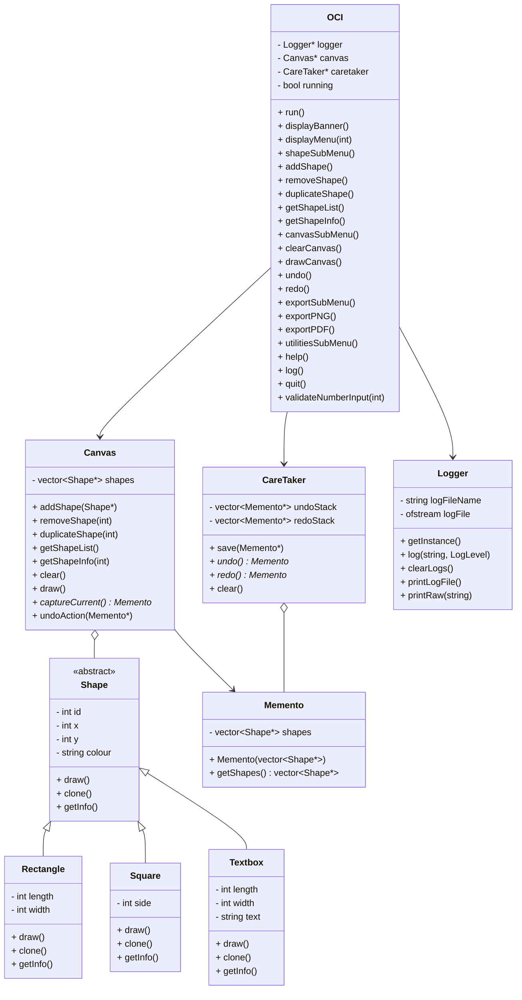

# Class Diagram (Mermaid)

---

This Mermaid diagram represents the class structure and relationships for the Open Canvas Interface (OCI) system, using std::vector for all stack and collection types, in compliance with the allowed libraries.
